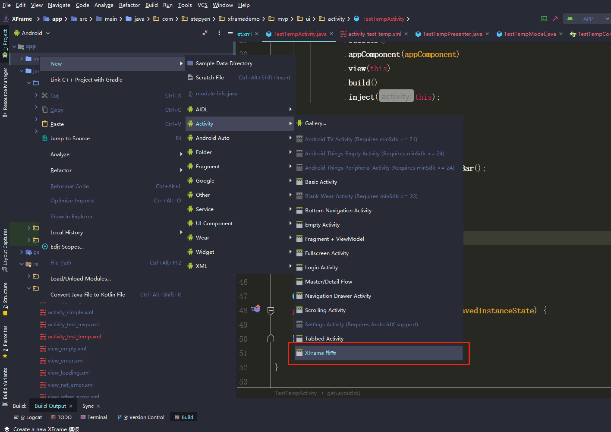

## 如何安装

请将 **MVPXFrameTemplate**  这个文件夹复制到 **AndroidStudio Activity** 模版的存放路径(其他模版同理), 请注意是复制整个文件夹, 不是里面的内容!

**AndroidStudio Activity** 模版存放路径 (**请注意是放在 activities 文件夹里, 不是 gradle-projects 文件夹!!!**):

* Windows : AS安装目录/plugins/android/lib/templates/activities

* Mac : /Applications/Android Studio.app/Contents/plugins/android/lib/templates/activities

**最后记得重启 AndroidStudio !**

## 如何使用

  

## 感谢 

[MVPArmsTemplate](https://github.com/JessYanCoding/MVPArmsTemplate)

